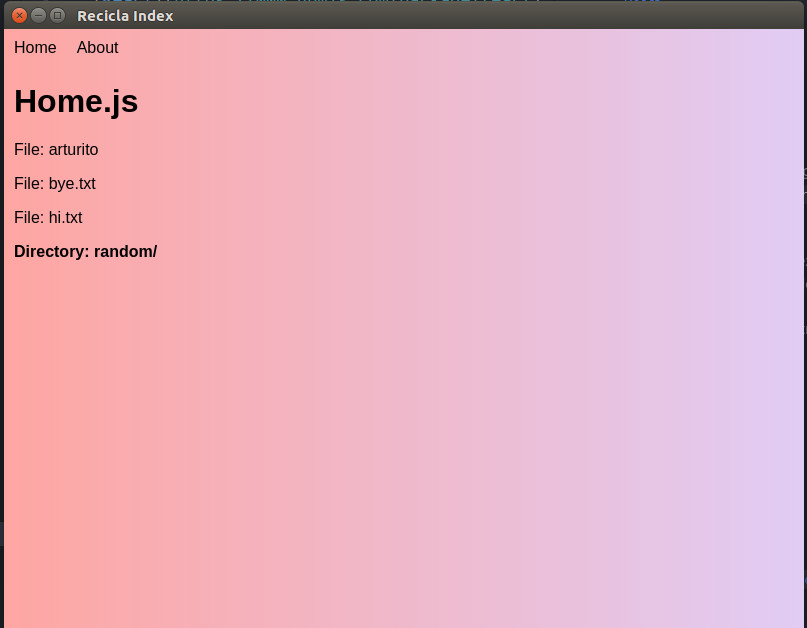

## electron-refiro

Simple boilerplate for starting an Electron app using:

* [React](https://www.npmjs.com/package/react)
* [Redux](https://www.npmjs.com/package/redux)
* [Redux-First-Router](https://www.npmjs.com/package/redux-first-router)
* [Glamor](https://www.npmjs.com/package/glamor)
* [Glamorous](https://www.npmjs.com/package/glamorous)

It's all packed with `webpack 4`

This boilerplate is not ready yet. Right now it only synchronous reads (in `src/configureStore.js`) the `src/directory` folder and pours the result into the state.

I'm planning on do a some sort of explorer where you can only create `.txt` files and folders inside the defined folder and that's it.

This, only to prove that it's an Electron app, working with `fs` and `path` in the 'client' side.

## TODO
* Finish the whole damn app
* Support for `css` `sass`
* `file-loader` support
* Production build
* ... More

**Special thanks to chentsulin's  [`electron-react-boilerplate`](https://github.com/chentsulin/electron-react-boilerplate)**
